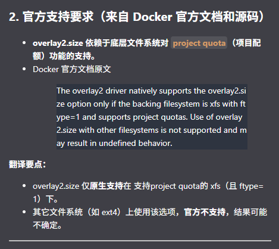
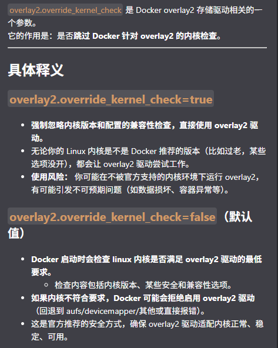

## 整合时需注意的事项

- K8S 脚本不再创建用户 appadm/ecip/appop/cmitpaas 及设置 sudo 权限

## 差异

- docker 版本不一样，现版本 28.0.4，原版本 20.10.14
- docker-compose 版本不一样，现版本 2.35.1，原版本 1.22.0
- containerd 版本不一样，现版本 1.7.27，原版本 1.7.11
- runc 版本不一样，现版本 1.2.6，原版本 1.1.11
- etcd 版本不一样，现版本 3.5.21，原版本 3.5.11
- pause 镜像版本不一样，现版本 3.8，原版本 3.1
- kubernetes 版本不一样，现版本 1.28.15，原版本 1.28.7
- 去除/etc/containerd/config.toml 下的鉴权配置，去除主备节点的配置
- /etc/docker/daemon.json 增加了根据 xfs.ftype 的值是否增加 overlay2.size 选项，去除 overlay2.override_kernel_check 选项  
    
  
- 去除 calico_ip_autodetection_method 参数 cidr=172.28.1.0/16，采用 can-reach={{ kube_apiserver_vip }}
- 宿主机不再配置coredns_ip解析地址
- 原harbor/cp_harbor主机组有fqdn_name属性定义harbor域名，现迁移至harbor_extra_hosts属性列表中，格式为"域名:IP"，可以是harbor_vip域名/harbor_node域名以及其他需要同步harbor域名
- harbor从必选模块变更为可选模块，k8s相关镜像不再从harbor拉取，而是复制至各主机
- harbor安装去除ec相关的模块
- harbor安装目录现为/apps/harbor，原目录在/app/harbor_setup/harbor
- harbor-ha安装目录现为/app/harbor-ha，原目录在/app/harbor_setup/harbor_ha
- kube-ha安装目录现为/app/kube-ha，原目录在/app/k8s-ha
- kube-ha及harbor-ha现在用nerdctl拉起，原先用docker拉起
- docker及docker-compose现在只安装在harbor节点上，并且去除了data-root及overlay2.size/overlay2.override_kernel_check参数（只部署goharbor容器），k8s节点只安装了containerd
- kubeconfig从{{ kube_ssl_dir }}移至{{ kube_config_dir }} yaoqing 2025/6/16 18:27
- 增加添加及删除节点操作（包含控制面及普通节点）
- apiserver_vip及coredns_vip不再是固定169.169.0.1/169.169.0.100，而是根据kube_service_cidr设置

## 操作系统

- BCLinux 21.10 欧拉
- BCLinux 8.2 龙蜥

## 保留差异

- 新增 nerdctl
  - k8s 相关镜像通过 tar 包复制至各节点，而不是从 harbor 仓库拉取
- kubeconfig 证书数据从文件路径变为 base64 值(certificate-authority -> certificate-authority-data)
- 控制面节点新增 node-role.kubernetes.io/control-plane 标签
- kube_config_dir 目录位置，是否将此参数设置为 {{ root_dir }}/etc/kubernetes
  > 默认 use_versioning_dir_layout = false，将 kube_config_dir 设置为 `/etc/kubernetes`，兼容现有脚本
